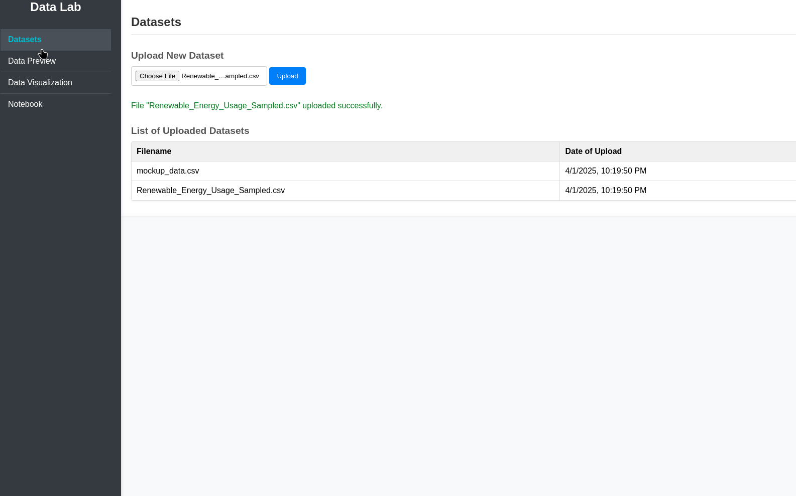

# VanillaJS DataLab 

Basic Analytics Website in Django that allows users to upload a CSV file, display the content as a table, and show statistics about the values in the table

## Overview
* Allow CSV file upload.
* Read and display the content of the CSV as a table.
* Show basic statistics about the data, such as counts, averages, min/max values, etc.

See the demo of the project: [Demo](https://rosa-lpz.github.io/VanillaJS-DataLab.github.io/) 

